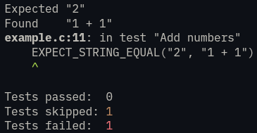

# cunittest

A simple C unit testing library.

Copy `cunittest.h` into your project and start writing tests!

Tutorial code in `example.c`.

## Features

- Easy to grok (less than 150 lines)
- Warns about unused tests
- Prints nice error messages with links to failing source code (if your editor supports it)
- Simple color coding of test results (recognize those test failures 0.05s faster!)



## Pitfalls

- Implemented with macros, so you can't use the EXPECT macros inside function calls.

```c
// This doesn't work
void what_is_one(int one) {
    EXPECT_INT_EQUAL(1, one);
}

TEST test_counting() {
    START_TEST("counting");
    what_is_one(1);
    END_TEST();
}
```

```c
// Do this instead
#define what_is_one(one)                                                       \
  do {                                                                         \
    EXPECT_INT_EQUAL(1, one);                                                  \
  } while (0)

TEST test_counting() {
    START_TEST("counting");
    what_is_one(1);
    END_TEST();
}
```
